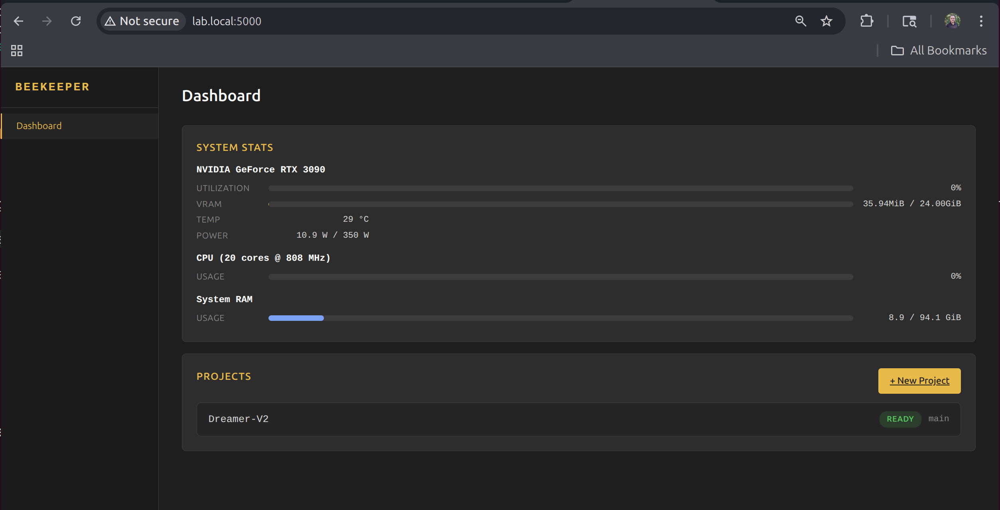

Beekeeper is a lightweight web app designed to allow you to do AI training on a remote server as part of your home lab. At its core, it's designed to handle -

1. Cloning a repository. 
2. Setting up the python environment(based on your requirements.txt)
3. Remote log streaming
4. Tensorboard Display
5. File downloads



Critical missing features...mostly security stuff.

1. Authentication - Beekeeper has no authentication, and it **does** allow access to files you've cloned or generated in your training run. For now, I would strongly recommend running Beekeeper only in a home lab scenario, where the server is sitting safely on your local network, and avoiding any sensitive data. 
2. GitHub auth - Beekeeper has no method of authenticating with your remote repo. It only works on repos you've made public. 
3. Https - For https, you'll need to put Beekeeper behind a proxy and, again, it's not ready to do anything secure anyway. 
4. Multi-server support - Eventually, I'd like to have a central Hive server managing multiple workers, and farming jobs out. Today is not that day. This is a single server product. 


## Getting Started

### Requirements

- Python 3.10+
- Git
- A Linux server with systemd(Currently tested on Ubuntu)
- One or more GPUs (optional but recommended)

### Installation

Clone the repo and run the setup script. It creates a virtual environment, installs dependencies, and sets up a systemd service.

```bash
git clone https://github.com/bobcowher/beekeeper.git
cd beekeeper
bash setup.sh
```

The setup script will:

1. Detect your Python version (3.12, 3.11, 3.10, or python3)
2. Create a venv and install dependencies
3. Generate and install a systemd service file (requires sudo)
4. Enable and start the service

Once complete, Beekeeper is running on port 5000. Open `http://your-server:5000` in a browser.

### Managing the Service

```bash
# Check status
sudo systemctl status beekeeper

# View logs
journalctl -u beekeeper -f

# Restart
sudo systemctl restart beekeeper

# Stop
sudo systemctl stop beekeeper
```

### Development Mode

If you prefer to run Beekeeper without systemd for development or testing:

```bash
cd beekeeper
source venv/bin/activate
python app.py
```

This runs Flask's development server on port 5000 with auto-reload.

## Creating a Project

From the dashboard, click **+ New Project** and fill in:

| Field | Description | Default |
|-------|-------------|---------|
| Project Name | No spaces, used as the directory name | — |
| Git URL | Public Git repository URL | — |
| Branch | Git branch to clone | `main` |
| Python Version | Detected from system and conda | auto |
| Training Script | Python file to run | `train.py` |
| Tensorboard Log Dir | Where your script writes TB logs | `runs` |
| Requirements File | Pip requirements to install | `requirements.txt` |
| Environment Type | venv or conda | `venv` |

Beekeeper clones the repo, creates an isolated environment, and installs dependencies in the background. The project page shows setup progress in real time.

## Running Training

Once setup completes, hit **Start Training** on the project page. Beekeeper pulls the latest code from your branch, then launches the training script as a detached subprocess — closing the browser tab has no effect on the running process.

The project page shows:

- **Status** — running, stopped, crashed, or idle
- **PID and elapsed time** while running
- **Live logs** — expand the Logs section to stream stdout/stderr in real time
- **Tensorboard** — auto-starts alongside training with a dynamic port, embedded as an iframe with an option to open in a new tab

Hit **Stop Training** to send SIGTERM (with a SIGKILL fallback after 5 seconds).

## Environment Variables

Training scripts often need environment variables — API keys, config flags, hyperparameters. Click **Edit** on the project info card to add key-value pairs. These are passed to the training process at startup.

## Editing Project Settings

Click **Edit** on the project page to change:

- Git branch
- Training script path
- Tensorboard log directory
- Requirements file
- Environment variables

Name, Git URL, Python version, and environment type are fixed after creation.

## Downloading Files

Expand the **Files** section on the project page to browse the project's source directory. You can download individual files or entire directories as zip archives.

### Using curl

The same endpoints that power the UI work with curl:

```bash
# List files in the project root
curl http://your-server:5000/projects/my-project/files/

# Download a specific file
curl -O http://your-server:5000/projects/my-project/files/checkpoints/model.pt

# Download a directory as a zip
curl -o checkpoints.zip 'http://your-server:5000/projects/my-project/files/checkpoints/?zip=1'
```

The JSON listing includes file names, sizes, and types — useful for scripting downloads of specific checkpoints or outputs.

## Tensorboard

Tensorboard starts automatically when training starts and stops when training stops. It runs from the project's own environment, so it uses whatever version of Tensorboard is in the project's requirements.

The port is allocated dynamically starting at 6006. You can:

- View it inline in the iframe on the project page
- Expand the iframe to full height
- Open it directly in a new browser tab
- Clear accumulated Tensorboard logs with the **Clear Tensorboard Logs** button

## System Stats

The dashboard shows live GPU, CPU, and memory stats, updated every 2 seconds. GPU monitoring uses nvitop for detailed per-GPU utilization, temperature, VRAM, and power draw.

## Project Structure

Beekeeper organizes everything under its install directory:

- `projects/` — one subdirectory per project
  - `project.json` — config and state
  - `src/` — cloned git repo
  - `venv/` — Python environment
  - `train.log` — training output
- `app.py` — Flask app
- `routes/` — HTTP endpoints
- `services/` — business logic
- `models/` — data models
- `templates/` — Jinja2 templates
- `static/` — CSS and JS
- `setup.sh` — installation script

## Notes

- Beekeeper runs with a single Gunicorn worker (`-w 1`) because training state is tracked in memory. The setup script configures this automatically.
- Training processes are fully detached — they survive browser disconnects, but not server reboots. After a reboot, the systemd service restarts Beekeeper, but any previously running training jobs will need to be restarted from the UI.
- There's no authentication yet. Don't expose Beekeeper to the public internet without putting it behind a reverse proxy with auth.
