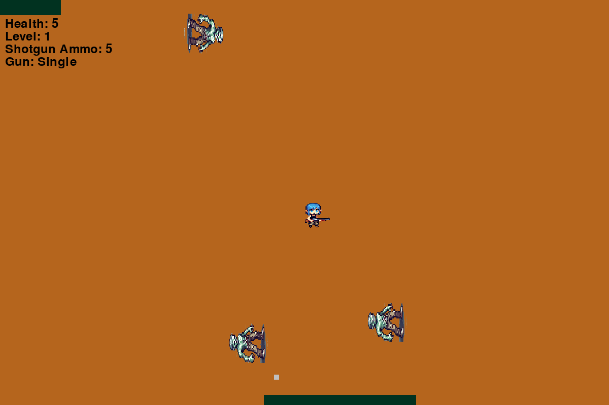

Zombie Shooter is a Gymnasium environment for reinforcement learning research. It's a top-down shooter where an agent must survive waves of zombies across three levels while managing health, ammunition, and weapon selection.



The environment provides grayscale 128×128 observations suitable for CNN-based agents and supports both autonomous RL training and human keyboard play.

## Installation

**Version**: 0.1.0 — Now available on PyPI!

```bash
pip install gym-zombie-shooter
```

### With Training Dependencies

To train agents using Stable Baselines3:

```bash
pip install gym-zombie-shooter
pip install stable-baselines3[extra]
pip install torch torchvision torchaudio --index-url https://download.pytorch.org/whl/cu129
```

## Quick Start

```python
import gymnasium as gym
import zombie_shooter_gym

env = gym.make('ZombieShooter-v1', render_mode='human')
obs, info = env.reset()

for _ in range(1000):
    action = env.action_space.sample()
    obs, reward, terminated, truncated, info = env.step(action)
    if terminated or truncated:
        obs, info = env.reset()

env.close()
```

## Environment Specification

| Property | Value |
|----------|-------|
| Observation Space | `Box(0, 255, (1, 128, 128), uint8)` |
| Observation Type | Grayscale image |
| Action Space | `Discrete(7)` |
| Max Episode Steps | 10,000 |
| Reward Range | [-100, 100] per step |

### Actions

| ID | Action | Description |
|----|--------|-------------|
| 0 | No-op | Do nothing |
| 1 | Move Up | Move player up |
| 2 | Move Down | Move player down |
| 3 | Move Left | Move player left |
| 4 | Move Right | Move player right |
| 5 | Switch Weapon | Toggle between pistol and shotgun |
| 6 | Shoot | Fire current weapon |

### Rewards

| Event | Reward |
|-------|--------|
| Kill zombie | +1 |
| Open treasure chest (gain ammo) | +1 |
| Collect health drop | +1 |
| Take damage | -1 |
| Die | 0 (episode terminates) |

### Episode Termination

- **Terminated**: Player health reaches 0
- **Truncated**: Level completed (triggers next level)

After completing all 3 levels, the episode terminates with `truncated=True`.

## Game Mechanics

### Weapons

- **Pistol**: Infinite ammo, single forward shot
- **Shotgun**: Limited ammo (starts with 5, max 20), 3-way spread shot

Shotgun ammunition is obtained by opening treasure chests scattered across each level.

### Health System

- Start: 5 HP
- Max: 100 HP
- Zombies deal 1 damage on contact
- Health drops spawn randomly when zombies are killed (20% chance)

### Levels

Three progressively difficult levels with unique wall layouts:

- **Level 1**: 5 zombies, 5 kills to advance
- **Level 2**: 7 zombies, 15 kills to advance, complex maze
- **Level 3**: 9 zombies, 30 kills to advance, tight corridors

Zombie spawn rate and movement speed increase with each level.

## Training with Stable Baselines3

A minimal DQN training example:

```python
import gymnasium as gym
import zombie_shooter_gym
from stable_baselines3 import DQN

env = gym.make('ZombieShooter-v1', render_mode='rgb_array')

model = DQN(
    "CnnPolicy",
    env,
    learning_rate=1e-4,
    buffer_size=50000,
    learning_starts=10000,
    batch_size=32,
    verbose=1
)

model.learn(total_timesteps=200000)
model.save("zombie_dqn")
```

### Hyperparameters

Tested configurations that produce learning:

| Parameter | Value | Notes |
|-----------|-------|-------|
| Learning rate | 1e-4 | Stable across architectures |
| Buffer size | 10k–50k | Larger improves sample diversity |
| Batch size | 32–64 | 32 is sufficient |
| Learning starts | 1k–10k | Start training after initial exploration |
| Target update | 1000 | Standard DQN |
| Exploration fraction | 0.3 | 30% of training |
| Final epsilon | 0.05 | Maintain some exploration |

## Human Play

Play the game yourself using keyboard controls:

```bash
# After installation
zombie-shooter-play
```

Or via Python:

```python
import gymnasium as gym
import zombie_shooter_gym

env = gym.make(
    'ZombieShooter-v1',
    window_width=1200,
    window_height=800,
    world_width=1800,
    world_height=1200,
    fps=60,
    sound=True,
    render_mode='human'
)

# Handle pygame events and key presses in your game loop
```

### Controls

| Key | Action |
|-----|--------|
| W/A/S/D | Move player |
| Space | Shoot |
| Tab | Switch weapon |
| ESC | Pause/Resume |

## Environment Parameters

When creating the environment, you can configure:

```python
env = gym.make(
    'ZombieShooter-v1',
    window_width=800,        # Display width (default: 800)
    window_height=600,       # Display height (default: 600)
    world_width=3000,        # World width (default: 3000)
    world_height=3000,       # World height (default: 3000)
    fps=60,                  # Frame rate (default: 60)
    sound=False,             # Enable audio (default: False)
    render_mode='rgb_array'  # 'human', 'rgb_array', or None
)
```

For RL training, use `render_mode='rgb_array'` and `sound=False` for faster execution.

## Expected Performance

Training results using DQN on a single RTX 5090:

| Timesteps | Training Time | Mean Reward | Behavior |
|-----------|---------------|-------------|----------|
| 10k | ~2 min | -5 to 0 | Random, dies quickly |
| 50k | ~6 min | 2–10 | Basic avoidance, occasional kills |
| 100k | ~12 min | 10–25 | Consistent kills, survives level 1 |
| 200k | ~24 min | 25–50 | Completes level 1, learns weapon switching |

Performance varies with network architecture, hyperparameters, and random seed.

## Info Dictionary

The `info` dict returned by `step()` contains:

```python
{
    'health': int,           # Current HP (0-100)
    'shotgun_ammo': int,     # Shotgun shells remaining (0-20)
    'gun_type': str,         # 'single' or 'shotgun'
    'gun_type_num': int,     # 1 for pistol, 2 for shotgun
    'bullets': int           # Bullets currently on screen
}
```

## Examples Repository

Full training scripts and validation code:

```bash
git clone https://github.com/bobcowher/zombie-shooter-gym-v1-test
cd zombie-shooter-gym-v1-test
./setup.sh
python train.py
```

The examples repo includes:
- Custom Double DQN training implementation
- Validation scripts
- Model testing utilities

## Reproducibility

For deterministic episodes:

```python
env = gym.make('ZombieShooter-v1')
obs, info = env.reset(seed=42)
```

Note: Zombie spawn timing and movement includes stochastic elements even with a fixed seed due to frame-based spawn rates.

## Requirements

- Python ≥ 3.8
- pygame ≥ 2.1.0
- gymnasium ≥ 0.26.0
- opencv-python ≥ 4.5.0
- numpy ≥ 1.20.0

## Source Code

- **Environment**: https://github.com/bobcowher/zombie-shooter-gym-v1
- **Training Examples**: https://github.com/bobcowher/zombie-shooter-gym-v1-test

## License

MIT License. See repository for full text.

## Contributors

**Author**: Robert Cowher
**Contributors**: Jason Mosley
